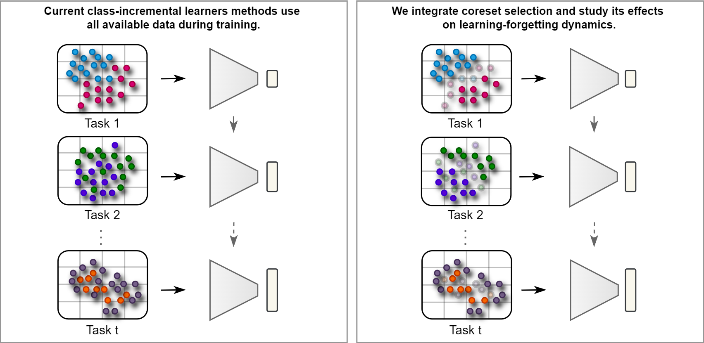

# Continual Learning with Informative Samples: An Empirical Evaluation of Coreset Strategies



## Introduction

Continual Learning (CL) addresses the challenge of enabling models to adapt to evolving data and tasks while retaining previously acquired knowledge. The main challenge in this paradigm is catastrophic forgetting, where models lose prior knowledge upon learning new tasks. While much of the CL literature has focused on model-centric innovations, we argue for the substantial potential of a data-centric approach, specifically by revisiting the "learn-it-all" assumption prevalent in current CL paradigms. This paper presents the first empirical study systematically evaluating the impact of different coreset methods for training samples in combination with CL methods. Unlike conventional uses of coreset selection limited to a memory buffer, we explore its broader potential to reduce the overall training set. Our comprehensive analysis reveals that training on carefully selected coreset substantially enhances incremental accuracy while reducing computational overhead. We demonstrate that this performance improvement is primarily driven by an improved stability-plasticity trade-off, largely attributable to the enhanced retention of prior knowledge. This study not only highlights the significant benefits of data-centric strategies in CL but also advocates for a shift in research focus towards these approaches to stimulate and guide future advancements in the field.

This benchmark contributes to a deeper understanding of selective learning strategies in CL scenarios. We built upon the [PYCIL library](https://github.com/G-U-N/PyCIL) and use [DeepCore](https://github.com/PatrickZH/DeepCore) for the coreset selection methods. We thank these repositories for providing helpful components.

## Dependencies

For the PYCIL:
1. [torch 1.81](https://github.com/pytorch/pytorch)
2. [torchvision 0.6.0](https://github.com/pytorch/vision)
3. [tqdm](https://github.com/tqdm/tqdm)
4. [numpy](https://github.com/numpy/numpy)
5. [scipy](https://github.com/scipy/scipy)
6. [quadprog](https://github.com/quadprog/quadprog)
7. [POT](https://github.com/PythonOT/POT)

## Datasets

The CIFAR10 and CIFAR100 datasets will be automatically downloaded. To train on another dataset, specify the dataset folder in `utils/data.py`. For further details, please refer to the PYCIL library.

## Coreset Methods

In the `selection` directory, we have implementations of:
- random
- herding
- uncertainty
- forgetting
- submodular (graphcut) methods

## Continual Learners

In the `models` directory, we have implementations of:
- der - architecture
- foster - architecture
- memo - architecture
- icarl - replay
- er - replay
- lwf - regularization

## Run Experiment

To run an experiment, edit the `[MODEL NAME].json` file for all settings like `dataset`, `memory_per_class`, `init_cls`, `increment`, `convnet`, `seed`, and `selection_method`. Then, run:

```bash
python main.py --config=./exps/[MODEL NAME].json
